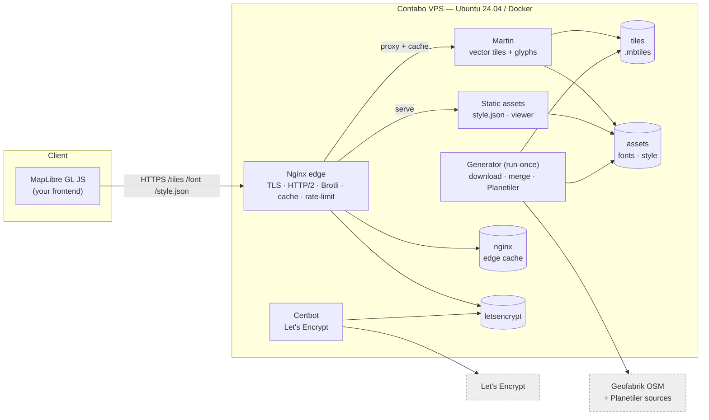
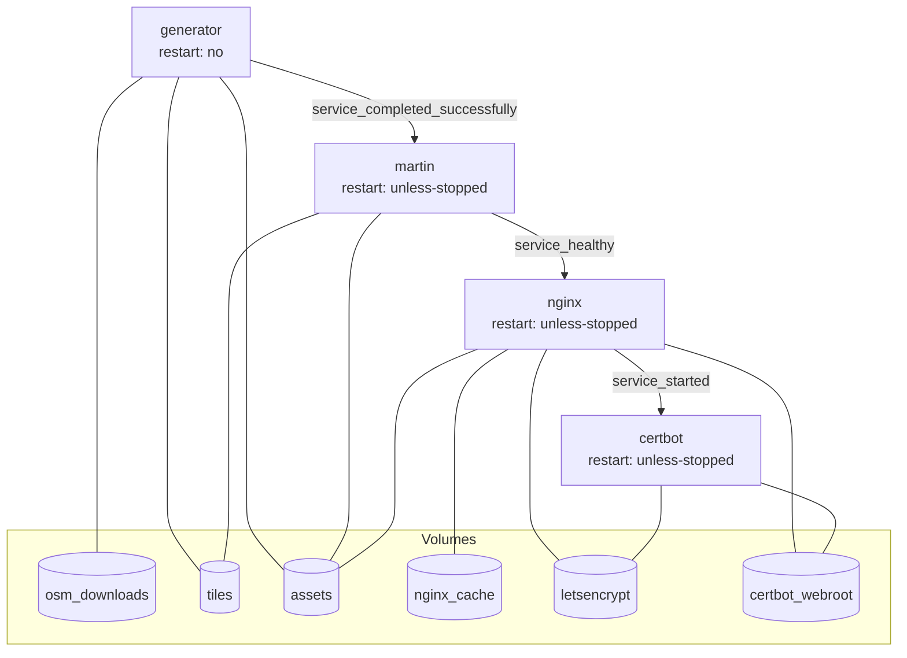
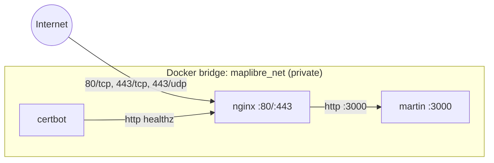
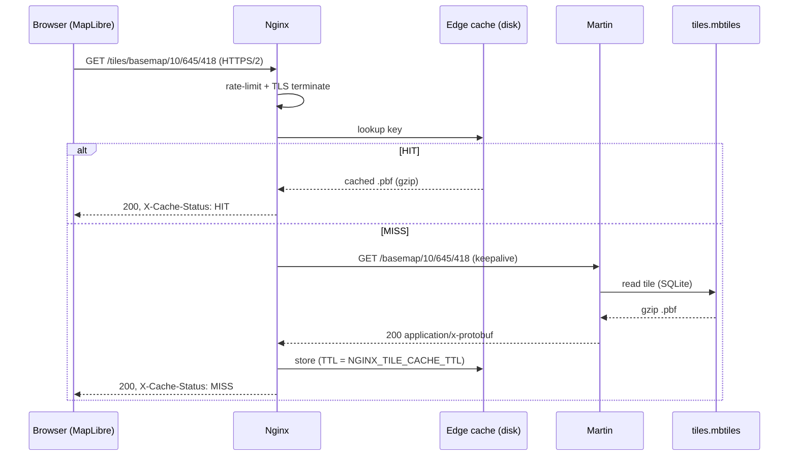
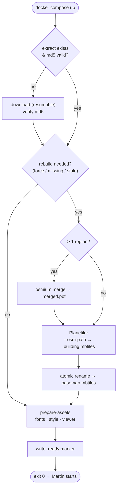
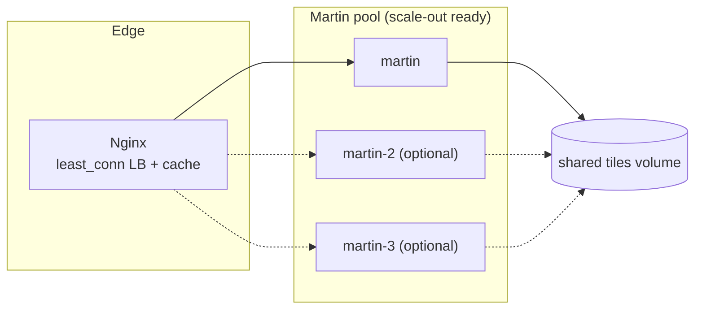

# Architecture (Phase 2)

This document covers the system design, Docker topology, networking, the
request lifecycle, and the tile generation/serving workflows. Diagrams are
Mermaid (render on GitHub or any Mermaid viewer).

---

## 1. High-level system architecture

The browser only ever talks to Nginx. Martin and the generator are private to
the Docker network. The generator runs once to produce the tileset and assets,
then exits; serving is handled entirely by Martin + Nginx.

---

## 2. Docker architecture & startup order

Dependency conditions (in `docker-compose.yml`) guarantee correct ordering and
prevent race conditions: tiles exist before Martin starts; Martin answers
`/health` before Nginx accepts traffic; Nginx serves the ACME path before
Certbot requests a certificate.

---

## 3. Network topology

Only Nginx publishes ports to the host. `martin`, `generator`, and `certbot`
have **no** published ports; Martin is reachable only as `http://martin:3000`
on the internal `mapnet` bridge. Nginx re-resolves the `martin` service name via
Docker DNS (`resolver 127.0.0.11`) so replica/restart IP changes are picked up.

---

## 4. Request lifecycle (a single tile)

Vector tiles are stored gzip-compressed inside the MBTiles and served with
`Content-Encoding: gzip`, so Nginx caches and forwards them **without
re-compressing**. Brotli/gzip in Nginx apply to `style.json`, glyph `.pbf`, and
other text assets.

---

## 5. Tile generation workflow (the run-once job)

Every stage is **idempotent**: a valid cached extract is reused, an up-to-date
tileset is not rebuilt, and outputs are published atomically (write to a temp
name, then rename on the same filesystem). Re-running `up` is always safe.

---

## 6. Tile serving workflow & scaling

Martin is stateless — every replica reads the same read-only tiles volume. To
scale, add `server martin-2:3000;` lines to `config/nginx/conf.d/upstream.conf`
and run more replicas. The edge cache absorbs the vast majority of reads, so a
single Martin instance already handles very high request rates.

---

## 7. Observability, health, logging, backup

- **Health:** container healthchecks (`/healthz` on Nginx, `/health` on Martin)
  drive Compose start ordering and restart decisions. `/health/upstream` exposes
  Martin's health through Nginx. Martin also exposes Prometheus metrics at
  `/_/metrics` (internal) for future scraping.
- **Logging:** all services log to Docker's `json-file` driver with rotation
  (10 MB × 5). Nginx access logs include cache status and upstream timing.
- **Backup:** `make backup` snapshots the `tiles`, `assets`, and `letsencrypt`
  volumes to `./backups`. Tiles are reproducible from OSM, so the critical
  irreplaceable state is just the certificates (and your `.env`).
- **Disaster recovery:** re-clone, restore `.env` + the `letsencrypt` snapshot
  (optional — certs re-issue automatically), `docker compose up -d`; tiles
  regenerate from scratch. See DEPLOYMENT for the full runbook.
